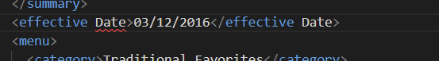
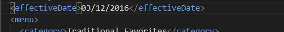
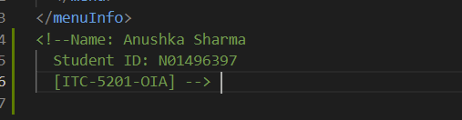
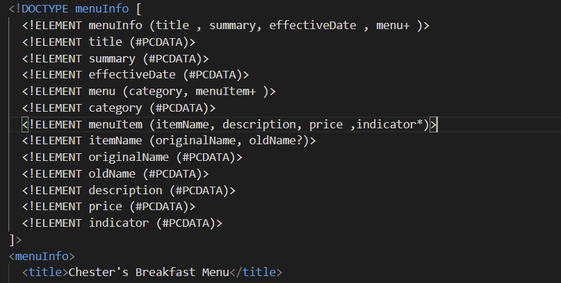
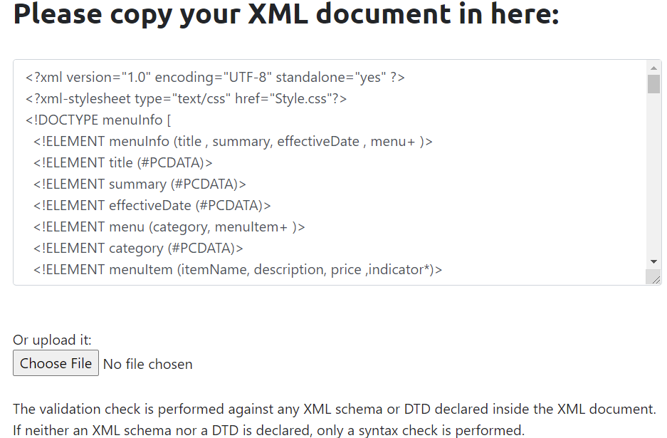

#  Assignment_1 
# [XML and JavaScript]

1. Yes, there was an error in line 11. The tag <effective Date> is the wrong format for 
element name as it cannot contain blank spaces. So , the correct format for element is 
<effectiveDate>.

2. CDATA block is usually used to mark a part of XML so that the parser doesn't interpret
 it as a markup. Since this content of CDATA doesn't contain (<,>,&) these characters, I think 
 CDATA block was not necessary here.

3.

4. Prolog section for this docment is 1,2 (statements). 1: XML declaration.
   2: reference for stylesheet(processing instruction for this XML).

   Document body: starts from <menuInfo> and ends at </menuInfo>

   Epilog section: whatever is after the closing tag of document body.
   here it is the name and student number of the student.

   Processing Instruction:at line 2( stylesheet)

5.

6. validation done on (xmlvalidation.com)-- no errors found

7. 

