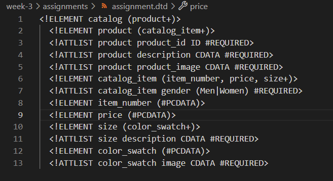
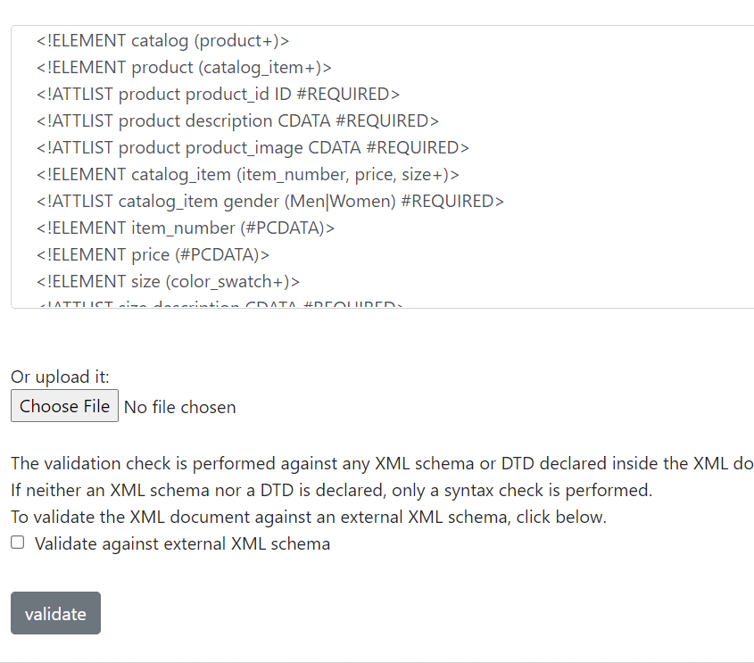
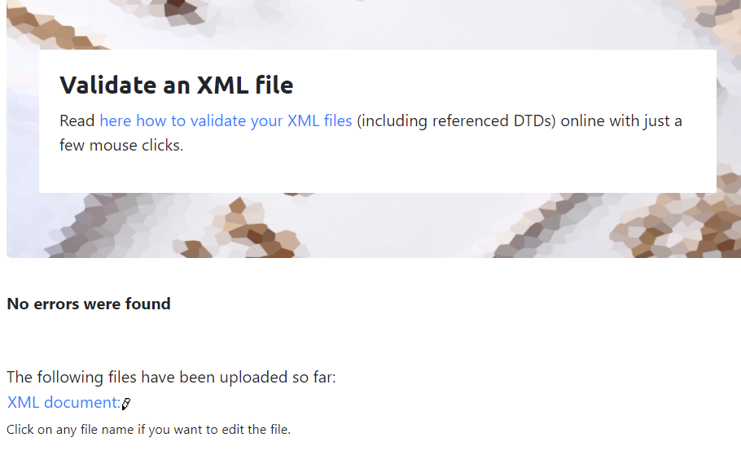
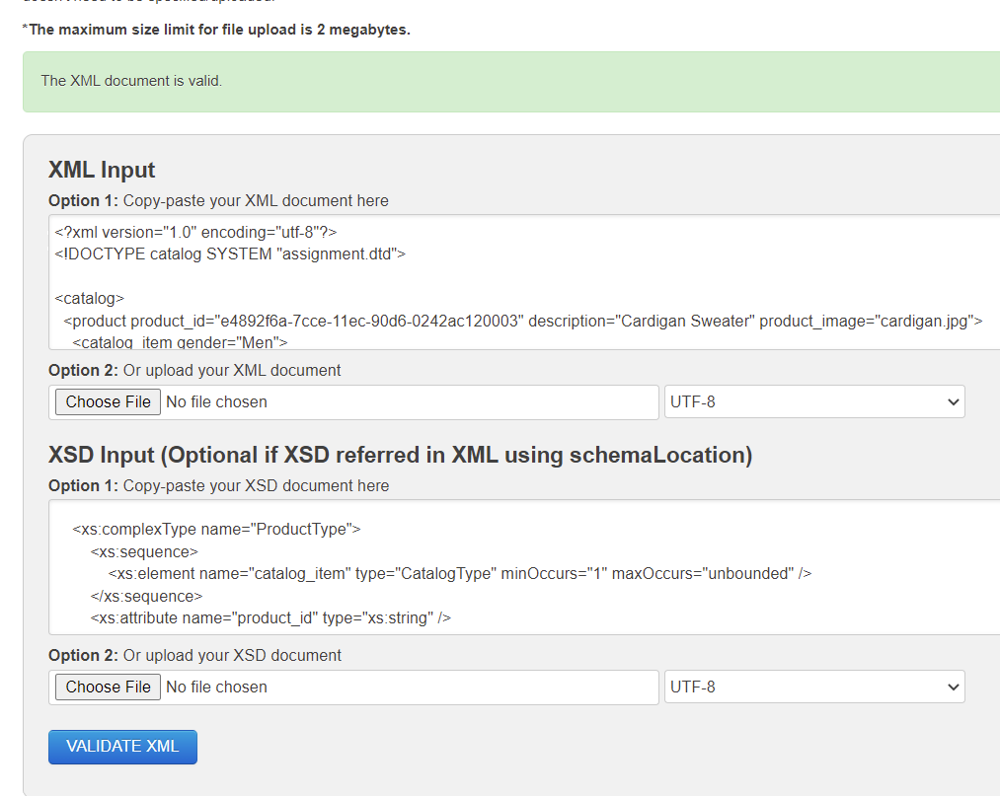

  DTD file for assignment.xml: 
 

 Validation using XML validator:
 
 

Validation of XSD of assignment.xml (using  https://www.freeformatter.com/xml-validator-xsd.html )

 Explain your thought process for these 2 declarations.

 -- I simply followed the slides provided in learning material for dtd creation. I have used #REQUIRED
  wherever the field cannot be avoided. I have used ENUMERATED dataType for gender as there were only 
  two values provided. Plus sign(+) cradinality is used for product, catalog_item and color_swatch because
  these items have to exist atleast once in their respective places.
-- XSD documentataion is a step-wise approach. Had to rewatch the recorded lecture for this. "catalog" is 
the root element in assignment.xml, which has only one element "product" that's why its occurence is "1".
In product (element) there is a sequence of catalog_items which is orruring twice. I have set its maximum
 occurence to unbounded. here it has to occur atleast once. Then there are attributes as defined in the xml.
 catalog_item has 3 elements it itself, out of which only "size" is occuring multiple times. ITS occurence is
  also " 1 to 'unbounded'". Similarly "color_swatch" can also occur multiple times. 

